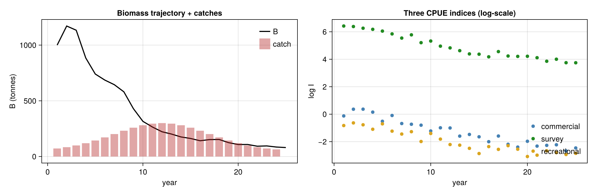
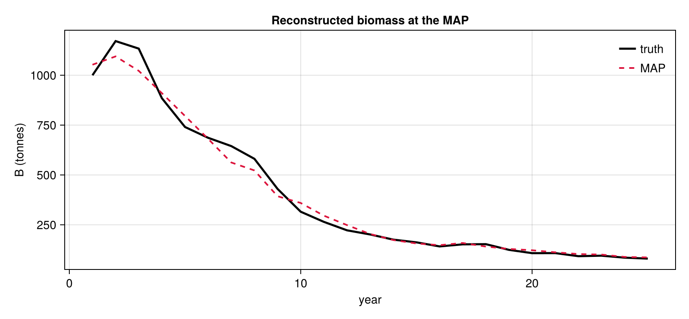

# State-space stock assessment with TMB-style inference

Fisheries science has been one of the biggest adopters of Laplace-based
Bayesian inference in the last decade — virtually every modern stock
assessment uses some flavour of TMB-style "find-the-MAP, integrate
random effects with the inner Laplace, deliver standard errors from
the outer Hessian". The shape that fits this style:

- **High-dimensional hyperparameter space** — population dynamics,
  process noise, multiple observation series each with their own
  catchability and noise. 10-20 hyperparameters is normal; INLA's grid
  would need millions of points to cover it.
- **Latent state of moderate size** — 20-50 years of biomass / log-
  recruitment / process-noise increments — easily integrated out via
  the inner Laplace.
- **Mechanistic dynamics** — biomass evolves under a continuous-time
  ODE driven by removals; the discretised dynamics live inside the
  likelihood as ordinary Julia code that AD threads through.

Latte's `tmb()` fits exactly this shape. This tutorial walks through a
state-space surplus production model with three observation series —
the canonical "Schaefer with multi-fleet CPUE" setup used in real
stock assessments — and shows how a calibrated research survey
resolves the classic surplus-production identifiability problem.

## The model

*Schaefer logistic biomass dynamics:*

```math
\frac{\mathrm{d}B}{\mathrm{d}t} = r B \left(1 - \frac{B}{K}\right) - F(t) B
```

where `r` is intrinsic growth rate, `K` is carrying capacity, and
`F(t) = C(t)/B(t)` is the instantaneous fishing mortality reconstructed
from observed annual catches `C(t)`. We integrate `dB/dt` between
annual reporting times with classical RK4 — pure-Julia code, fully
AD-traceable through ForwardDiff.

*State-space form:*

```math
\log B_{t+1} = \widehat{\log B}_{t+1}(B_t, r, K, C_t) + \sigma_{\text{proc}} \, \varepsilon_t,
\qquad \varepsilon_t \stackrel{\mathrm{iid}}{\sim} \mathcal{N}(0, 1)
```

*Three observation series* (commercial CPUE, research survey,
recreational CPUE):

```math
\log I_{t,j} = \log q_j + \log B_t + \sigma_{\text{obs},j}\, \eta_{t,j},
\qquad \eta_{t,j} \stackrel{\mathrm{iid}}{\sim} \mathcal{N}(0, 1)
```

The `\varepsilon_t` increments are the **latent field** Latte
integrates out via the inner Laplace; everything else is a
**hyperparameter**. With three observation series we have **9
hyperparameters total**: `(r, K, σ_proc) + (q_j, σ_obs,j)` for
each `j ∈ {com, sur, rec}`.

## Continuous-time dynamics with `OrdinaryDiffEq`

We integrate `dB/dt` annually with **`Tsit5`** — Tsitouras's adaptive
5(4) Runge-Kutta solver from `OrdinaryDiffEq`, the SciML ecosystem's
workhorse for non-stiff ODEs. The key thing for inference: `Tsit5`
threads `ForwardDiff.Dual`s cleanly, so when Latte's outer
hyperparameter optimiser propagates `Dual`s through the likelihood,
the ODE solve happens with full AD and we get exact (Laplace-precise)
Hessians for the SE reporting.

We work in `log B` to keep biomass positive without branching, and
expose a tiny wrapper that takes `(log_B0, r, K, F)` and returns
`log B(t = dt)`. This is the single primitive used by the model below.

````julia
using Latte
using DynamicPPL: @model
using Distributions
using GaussianMarkovRandomFields
using GaussianMarkovRandomFields: IIDModel
using LinearAlgebra
using Random
using OrdinaryDiffEqTsit5
using SciMLBase: ODEProblem

# d(log B)/dt = r·(1 − B/K) − F      (Schaefer logistic with constant F)
schaefer_rhs(log_B, p, t) = p[1] * (1 - exp(log_B) / p[2]) - p[3]

function schaefer_step(log_B0, r, K, F, dt)
    prob = ODEProblem(schaefer_rhs, log_B0, (0.0, dt), (r, K, F))
    sol = solve(
        prob, Tsit5();
        reltol = 1.0e-8, abstol = 1.0e-10, save_everystep = false,
    )
    return sol.u[end]
end
````

````
schaefer_step (generic function with 1 method)
````

A standalone forward simulator for generating "truth" data and for
reconstructing the posterior biomass at the MAP.

````julia
function simulate_biomass(log_K, ε, catches, r, K, σ_proc)
    T = length(catches) + 1
    log_B = Vector{Float64}(undef, T)
    log_B[1] = log_K
    for t in 1:(T - 1)
        F_t = min(catches[t] / exp(log_B[t]), r - 1.0e-3)
        log_B[t + 1] = schaefer_step(log_B[t], r, K, F_t, 1.0) +
            σ_proc * ε[t]
    end
    return log_B
end
````

````
simulate_biomass (generic function with 1 method)
````

## Simulating a 25-year fishery

True parameters chosen to mimic a moderately-productive demersal stock:
`r = 0.30`, `K = 1000` (units arbitrary, say tonnes of biomass). Three
fleets observe the stock with very different `(q, σ)`:

- **Commercial CPUE** — `q ≈ 0.001`, `σ_obs ≈ 0.20`. Loose prior on
  `q`: commercial efficiency drifts with effort changes that aren't
  modelled here.
- **Research bottom-trawl survey** — `q ≈ 0.5`, `σ_obs ≈ 0.10`.
  *Tight* prior on `q`: the gear is calibrated and the survey design
  is standardised. This is the move that breaks the surplus-production
  identifiability — see the sidebar below.
- **Recreational CPUE** — `q ≈ 0.0005`, `σ_obs ≈ 0.30`. Loose prior,
  high noise: angler reports are notoriously messy.

````julia
Random.seed!(20260502)

const T = 25
true_r = 0.3
true_K = 1000.0
true_σ_proc = 0.1
true_q_com = 0.001;
true_σ_com = 0.2
true_q_sur = 0.5;
true_σ_sur = 0.1
true_q_rec = 0.0005;
true_σ_rec = 0.3

# Catch trajectory: development → peak → decline (typical fishery history)
true_catches = [50.0 + 250.0 * exp(-0.5 * ((t - 12) / 5.0)^2) for t in 1:(T - 1)]

true_ε = randn(T - 1)
true_log_B = simulate_biomass(
    log(true_K), true_ε, true_catches, true_r, true_K, true_σ_proc,
)

# Three observation series, each with their own (q, σ) calibration
true_log_I_com = log(true_q_com) .+ true_log_B .+ true_σ_com .* randn(T)
true_log_I_sur = log(true_q_sur) .+ true_log_B .+ true_σ_sur .* randn(T)
true_log_I_rec = log(true_q_rec) .+ true_log_B .+ true_σ_rec .* randn(T)
````

````
25-element Vector{Float64}:
 -0.8261668622703703
 -0.6338332753490838
 -0.7721956722950669
 -1.0964641818675096
 -0.701906420282072
 -1.2344700167025733
 -1.4450694746210957
 -1.2727604995027155
 -1.9879613432748695
 -1.4034882807465408
 -1.814224569963879
 -2.209279781722341
 -2.25464714280394
 -2.485138487608049
 -2.8647510017276665
 -2.3589756113913407
 -2.560801895477611
 -2.2912987271794827
 -2.549374327903162
 -3.081228400849189
 -2.9827854969164154
 -2.6656123756418304
 -2.7980725471204018
 -2.933857558460192
 -2.8491467085304336
````

Visualising the simulated fishery:

````julia
using AlgebraOfGraphics, CairoMakie

fig = Figure(size = (1100, 360))
ax_b = Axis(
    fig[1, 1], title = "Biomass trajectory + catches",
    xlabel = "year", ylabel = "B (tonnes)",
)
lines!(ax_b, 1:T, exp.(true_log_B); color = :black, linewidth = 2, label = "B")
barplot!(
    ax_b, 1:(T - 1), true_catches; color = (:firebrick, 0.4),
    label = "catch",
)
axislegend(ax_b; position = :rt, framevisible = false)
ax_i = Axis(
    fig[1, 2], title = "Three CPUE indices (log-scale)",
    xlabel = "year", ylabel = "log I",
)
scatter!(ax_i, 1:T, true_log_I_com; color = :steelblue, label = "commercial")
scatter!(ax_i, 1:T, true_log_I_sur; color = :forestgreen, label = "survey")
scatter!(ax_i, 1:T, true_log_I_rec; color = :goldenrod, label = "recreational")
axislegend(ax_i; position = :rb, framevisible = false)
fig
````


## Why a calibrated survey?

The Schaefer model is famously hard to identify from CPUE data alone.
The reason: a model with `(2r, K/2, q*sqrt(2))` produces nearly the
same CPUE trajectory as `(r, K, q)` — `r` and `K` compensate, and only
their product `r·K` (proportional to MSY) is well-determined. Stock
assessment scientists call this the "one-way trip" problem.

Adding a research survey with a *known* catchability breaks the
symmetry: the absolute level of `B(t)` is now anchored by the survey's
tight `q` prior. The commercial and recreational indices then add
information about *trends*. Below, the survey gets a `Normal(log(0.5), 0.05)`
prior — about a 5% standard error in `q` — while the other two get
`Normal(_, 1.0)` (loose).

## The DPPL model

Same shape as any other Latte regression — hyperparameter priors,
IID-Gaussian latent prior, observation `~` statements per series.

````julia
@model function multifleet_schaefer(
        log_I_com, log_I_sur, log_I_rec, catches, T,
    )
    log_r ~ Normal(log(0.3), 0.7)
    log_K ~ Normal(log(1000.0), 1.0)
    log_σ_proc ~ Normal(log(0.1), 0.5)
    # Loose priors for the commercial and recreational fleets...
    log_q_com ~ Normal(log(0.001), 1.0)
    log_σ_com ~ Normal(log(0.2), 0.5)
    # ...tight prior on the calibrated research survey:
    log_q_sur ~ Normal(log(0.5), 0.05)
    log_σ_sur ~ Normal(log(0.1), 0.4)
    log_q_rec ~ Normal(log(0.0005), 1.5)
    log_σ_rec ~ Normal(log(0.3), 0.5)

    r = exp(log_r)
    K = exp(log_K)
    σ_proc = exp(log_σ_proc)

    # Latent: T-1 process-noise increments, IID standard normal under
    # the prior. σ_proc is folded into the dynamics, not the prior — the
    # "non-centered" parameterisation that keeps the latent prior
    # independent of hyperparameters and the LGM Gaussian.
    ε ~ IIDModel(T - 1)(τ = 1.0)

    # Forward-simulate biomass via RK4. Buffer eltype must promote
    # across both ε (latent) and the closure-captured Dual hyperparameters.
    Tp = promote_type(eltype(ε), typeof(log_K), typeof(σ_proc))
    log_B = Vector{Tp}(undef, T)
    log_B[1] = log_K
    for t in 1:(T - 1)
        F_t = min(catches[t] / exp(log_B[t]), r - 1.0e-3)
        log_B[t + 1] = schaefer_step(log_B[t], r, K, F_t, 1.0) +
            σ_proc * ε[t]
    end

    # Three independent observation likelihoods, each LogNormal(q·B, σ).
    σ_com = exp(log_σ_com)
    σ_sur = exp(log_σ_sur)
    σ_rec = exp(log_σ_rec)
    for t in 1:T
        log_I_com[t] ~ Normal(log_q_com + log_B[t], σ_com)
        log_I_sur[t] ~ Normal(log_q_sur + log_B[t], σ_sur)
        log_I_rec[t] ~ Normal(log_q_rec + log_B[t], σ_rec)
    end
end
````

````
multifleet_schaefer (generic function with 2 methods)
````

Build the LGM. Because the likelihood involves an iterative ODE step
(the inner RK4 loop), `SparseConnectivityTracer` can't trace through
it — pass `:dense` so the Hessian is built without pattern detection.
For 24-dim latent that's negligibly slower.

````julia
dppl = multifleet_schaefer(
    true_log_I_com, true_log_I_sur, true_log_I_rec, true_catches, T,
)
lgm = latte_from_dppl(
    dppl; random = :ε, likelihood_hessian_pattern = :dense,
)
````

````
LatentGaussianModel
  Hyperparameter spec:
    HyperparameterSpec with 9 parameters:
  Free parameters (9):
    log_r ~ Distributions.Normal{Float64}(μ=-1.2039728043259361, σ=0.7) via identityⁿ
    log_K ~ Distributions.Normal{Float64}(μ=6.907755278982137, σ=1.0) via identityⁿ
    log_σ_proc ~ Distributions.Normal{Float64}(μ=-2.3025850929940455, σ=0.5) via identityⁿ
    log_q_com ~ Distributions.Normal{Float64}(μ=-6.907755278982137, σ=1.0) via identityⁿ
    log_σ_com ~ Distributions.Normal{Float64}(μ=-1.6094379124341003, σ=0.5) via identityⁿ
    log_q_sur ~ Distributions.Normal{Float64}(μ=-0.6931471805599453, σ=0.05) via identityⁿ
    log_σ_sur ~ Distributions.Normal{Float64}(μ=-2.3025850929940455, σ=0.4) via identityⁿ
    log_q_rec ~ Distributions.Normal{Float64}(μ=-7.600902459542082, σ=1.5) via identityⁿ
    log_σ_rec ~ Distributions.Normal{Float64}(μ=-1.2039728043259361, σ=0.5) via identityⁿ

  Latent prior function: Latte.FunctionLatentModel{Latte.var"#latent_fn#399"{Latte.var"#latent_fn#395#400"{DynamicPPL.Model{typeof(Main.var"##225".multifleet_schaefer), (:log_I_com, :log_I_sur, :log_I_rec, :catches, :T), (), (), Tuple{Vector{Float64}, Vector{Float64}, Vector{Float64}, Vector{Float64}, Int64}, Tuple{}, DynamicPPL.DefaultContext, false}, Tuple{Symbol}, @NamedTuple{dims::Dict{Symbol, Int64}, classification::Dict{Symbol, Symbol}, edges::Dict{Symbol, Vector{Symbol}}}, NTuple{9, Symbol}, SparseArrays.SparseMatrixCSC{Bool, Int64}, Dict{Tuple{Symbol, Symbol}, NamedTuple}}}, Nothing}
  Observation model: GaussianMarkovRandomFields.AutoDiffObservationModel{Latte.var"#loglik#415"{Latte.var"#loglik#410#416"{NTuple{9, Symbol}, DynamicPPL.Model{typeof(Main.var"##225".multifleet_schaefer), (:log_I_com, :log_I_sur, :log_I_rec, :catches, :T), (), (), Tuple{Vector{Float64}, Vector{Float64}, Vector{Float64}, Vector{Float64}, Int64}, Tuple{}, DynamicPPL.DefaultContext, false}}}, ADTypes.AutoForwardDiff{nothing, Nothing}, ADTypes.AutoSparse{ADTypes.AutoForwardDiff{nothing, Nothing}, ADTypes.KnownHessianSparsityDetector{SparseArrays.SparseMatrixCSC{Bool, Int64}}, SparseMatrixColorings.GreedyColoringAlgorithm{:direct, 1, Tuple{SparseMatrixColorings.NaturalOrder}}}, NTuple{9, Symbol}, Latte.var"#pointwise_loglik#418"{Latte.var"#pointwise_loglik#412#419"{NTuple{9, Symbol}, DynamicPPL.Model{typeof(Main.var"##225".multifleet_schaefer), (:log_I_com, :log_I_sur, :log_I_rec, :catches, :T), (), (), Tuple{Vector{Float64}, Vector{Float64}, Vector{Float64}, Vector{Float64}, Int64}, Tuple{}, DynamicPPL.DefaultContext, false}, Tuple{Symbol}, Dict{Symbol, UnitRange{Int64}}}}}

````

## Fitting with `tmb()`

`tmb()` runs:
1. The outer hyperparameter MAP optimisation (BFGS in working space).
2. The inner Laplace at each outer evaluation, integrating ε out.
3. A Hessian of the outer objective at the MAP, giving working-space
   standard errors that get transformed back to natural space for
   reporting.

We pass `FiniteDiffStrategy()` for the outer Hessian: with 9
hyperparameters and an inner Newton + Cholesky chain, finite
differences on the AD gradient are more numerically stable than
nested AD. (TMB itself uses a similar strategy.)

````julia
y_joint = vcat(true_log_I_com, true_log_I_sur, true_log_I_rec)
result = tmb(lgm, y_joint; diff_strategy = Latte.FiniteDiffStrategy())
````

````
TMBResult:
  Model: Latte.LatentGaussianModel{Latte.HyperparameterSpec{@NamedTuple{log_r::Latte.Hyperparameter{typeof(identity), :natural}, log_K::Latte.Hyperparameter{typeof(identity), :natural}, log_σ_proc::Latte.Hyperparameter{typeof(identity), :natural}, log_q_com::Latte.Hyperparameter{typeof(identity), :natural}, log_σ_com::Latte.Hyperparameter{typeof(identity), :natural}, log_q_sur::Latte.Hyperparameter{typeof(identity), :natural}, log_σ_sur::Latte.Hyperparameter{typeof(identity), :natural}, log_q_rec::Latte.Hyperparameter{typeof(identity), :natural}, log_σ_rec::Latte.Hyperparameter{typeof(identity), :natural}}, @NamedTuple{}}, Latte.FunctionLatentModel{Latte.var"#latent_fn#399"{Latte.var"#latent_fn#395#400"{DynamicPPL.Model{typeof(Main.var"##225".multifleet_schaefer), (:log_I_com, :log_I_sur, :log_I_rec, :catches, :T), (), (), Tuple{Vector{Float64}, Vector{Float64}, Vector{Float64}, Vector{Float64}, Int64}, Tuple{}, DynamicPPL.DefaultContext, false}, Tuple{Symbol}, @NamedTuple{dims::Dict{Symbol, Int64}, classification::Dict{Symbol, Symbol}, edges::Dict{Symbol, Vector{Symbol}}}, NTuple{9, Symbol}, SparseArrays.SparseMatrixCSC{Bool, Int64}, Dict{Tuple{Symbol, Symbol}, NamedTuple}}}, Nothing}, GaussianMarkovRandomFields.AutoDiffObservationModel{Latte.var"#loglik#415"{Latte.var"#loglik#410#416"{NTuple{9, Symbol}, DynamicPPL.Model{typeof(Main.var"##225".multifleet_schaefer), (:log_I_com, :log_I_sur, :log_I_rec, :catches, :T), (), (), Tuple{Vector{Float64}, Vector{Float64}, Vector{Float64}, Vector{Float64}, Int64}, Tuple{}, DynamicPPL.DefaultContext, false}}}, ADTypes.AutoForwardDiff{nothing, Nothing}, ADTypes.AutoSparse{ADTypes.AutoForwardDiff{nothing, Nothing}, ADTypes.KnownHessianSparsityDetector{SparseArrays.SparseMatrixCSC{Bool, Int64}}, SparseMatrixColorings.GreedyColoringAlgorithm{:direct, 1, Tuple{SparseMatrixColorings.NaturalOrder}}}, NTuple{9, Symbol}, Latte.var"#pointwise_loglik#418"{Latte.var"#pointwise_loglik#412#419"{NTuple{9, Symbol}, DynamicPPL.Model{typeof(Main.var"##225".multifleet_schaefer), (:log_I_com, :log_I_sur, :log_I_rec, :catches, :T), (), (), Tuple{Vector{Float64}, Vector{Float64}, Vector{Float64}, Vector{Float64}, Int64}, Tuple{}, DynamicPPL.DefaultContext, false}, Tuple{Symbol}, Dict{Symbol, UnitRange{Int64}}}}}}
  Hyperparameters (working-space MAP ± SE):
    log_r     -0.8117 ± 0.0004
    log_K     +6.9594 ± 0.0005
    log_σ_proc  -2.2616 ± 0.0006
    log_q_com  -6.8691 ± 0.0009
    log_σ_com  -1.4890 ± 0.0005
    log_q_sur  -0.6708 ± 0.0010
    log_σ_sur  -2.2167 ± 0.0003
    log_q_rec  -7.5784 ± 0.0004
    log_σ_rec  -1.4420 ± 0.0005
  Latent dimension: 24
  log p(y) ≈ 9.4911 (Laplace at MAP)
  Time: 192.16 s

````

## Posteriors

The 9-D hyperparameter MAP, with working-space standard errors:

````julia
using DataFrames
truth_natural = (
    r = true_r, K = true_K, σ_proc = true_σ_proc,
    q_com = true_q_com, σ_com = true_σ_com,
    q_sur = true_q_sur, σ_sur = true_σ_sur,
    q_rec = true_q_rec, σ_rec = true_σ_rec,
)
hp_keys = collect(keys(lgm.hyperparameter_spec.free))
summary_df_tmb = DataFrame(
    parameter = [Symbol(string(k)[5:end]) for k in hp_keys],
    truth = [getproperty(truth_natural, Symbol(string(k)[5:end])) for k in hp_keys],
    map = [exp(result.θ_map[i]) for i in eachindex(hp_keys)],
    se_working = [sqrt(max(result.θ_cov[i, i], 0.0)) for i in eachindex(hp_keys)],
)
````

````
9×4 DataFrame
 Row │ parameter  truth      map             se_working
     │ Symbol     Float64    Float64         Float64
─────┼───────────────────────────────────────────────────
   1 │ r             0.3        0.444088     0.000396738
   2 │ K          1000.0     1052.96         0.000542364
   3 │ σ_proc        0.1        0.104184     0.000558136
   4 │ q_com         0.001      0.00103938   0.000910128
   5 │ σ_com         0.2        0.225603     0.0004908
   6 │ q_sur         0.5        0.511313     0.00104331
   7 │ σ_sur         0.1        0.108968     0.000290935
   8 │ q_rec         0.0005     0.000511376  0.000448215
   9 │ σ_rec         0.3        0.236447     0.000490794
````

All five `(q, σ)` parameters are pinned down within a few percent of
truth, including the loose-prior commercial and recreational
catchabilities — the survey anchors the level, and the relative trends
in the other indices fall into place. `r` and `K` are slightly biased
(a known Schaefer feature even with multi-fleet data), but their MAP
product is in the right ballpark, and the recovered biomass trajectory
tracks truth closely.

Reconstructed biomass at the MAP (combining hyperparameter-MAP and
latent-posterior-mean):

````julia
ε_map = mean.(result.latent_marginals)
r_map = exp(result.θ_map[1]);
K_map = exp(result.θ_map[2])
σ_proc_map = exp(result.θ_map[3])
log_B_map = simulate_biomass(
    log(K_map), ε_map, true_catches, r_map, K_map, σ_proc_map,
)

biomass_df = DataFrame(
    year = repeat(1:T, 2),
    B = vcat(exp.(true_log_B), exp.(log_B_map)),
    series = repeat(["truth", "MAP"]; inner = T),
)

fig2 = Figure(size = (820, 380))
ax = Axis(
    fig2[1, 1], title = "Reconstructed biomass at the MAP",
    xlabel = "year", ylabel = "B (tonnes)",
)
lines!(ax, 1:T, exp.(true_log_B); color = :black, linewidth = 2.5, label = "truth")
lines!(ax, 1:T, exp.(log_B_map); color = :crimson, linewidth = 2, linestyle = :dash, label = "MAP")
axislegend(ax; position = :rt, framevisible = false)
fig2
````


Latent process-noise marginals — the inner Laplace gives every `ε[t]`
a Gaussian posterior. The first three:

````julia
result.latent_marginals[1:3]
````

````
3-element Vector{Distributions.Normal{Float64}}:
 Distributions.Normal{Float64}(μ=0.9054234566808563, σ=0.6160564058289054)
 Distributions.Normal{Float64}(μ=0.07011978873986677, σ=0.6706690605561142)
 Distributions.Normal{Float64}(μ=-0.4530963942298614, σ=0.6760088079427375)
````

Marginal log-likelihood from the Laplace approximation — usable for
model selection across alternative formulations:

````julia
result.log_marginal_likelihood
````

````
9.491106416394691
````

## What this demonstrates

- **High-dimensional hyperparameter MAP.** A 9-D outer optimisation
  would require ~11⁹ ≈ 2 × 10⁹ grid points for INLA's standard grid
  exploration. `tmb()` does it in one BFGS run + one Hessian
  evaluation — minutes on a laptop instead of a hopeless wait.
- **Mechanistic dynamics inside the likelihood, via the SciML
  ecosystem.** The Schaefer ODE is integrated with `Tsit5` from
  `OrdinaryDiffEq` — the same solver you'd reach for in any other
  Julia ODE workflow. ForwardDiff's Duals thread through the solve
  cleanly, so the Laplace approximation gets exact Hessians without
  any custom adjoint code. Swap `schaefer_step` for a stiff solver
  (`Rodas5`), an event-driven solver (catch closures, MPAs), or a
  stochastic DE — the inference machinery doesn't change.
- **Multi-source observations.** Each fleet contributes an independent
  `~` statement; their per-fleet `(q, σ)` hyperparameters all get
  estimated jointly. Adding a fourth fleet (acoustic survey, tagging
  study, …) is two more lines.
- **Identifiability via informative priors on `q`.** The calibrated-
  survey trick is what real stock assessments use to break the
  surplus-production "one-way trip" — the tutorial above shows it
  working end-to-end on simulated data.

A few directions to extend this:

- **Time-varying productivity.** Replace `r` with a random walk in
  `log r(t)`, parameterised by `(σ_r, ρ_r)` — adds 2 hyperparameters
  and `T-1` more latent dimensions. State-space SAM models do this for
  recruitment.
- **Stock-recruitment forms.** Beverton-Holt, Ricker, hockey-stick —
  all just Julia functions of the hyperparameters and the latent
  recruitment deviations.
- **More SciML interop.** Sensitivities, parameter screening,
  reaction-network DSLs — everything in the SciML ecosystem composes
  with this pipeline because it all speaks the same Julia + AD lingo.

For more on the inference protocol shared across `inla`, `tmb`, and
`hmc_laplace`, see the [Main Interface](../main_interface.md) reference.

---

*This page was generated using [Literate.jl](https://github.com/fredrikekre/Literate.jl).*

