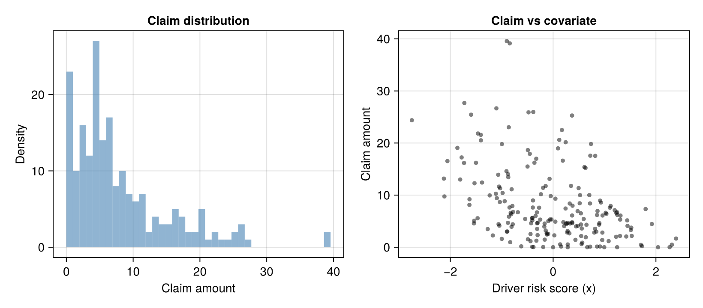
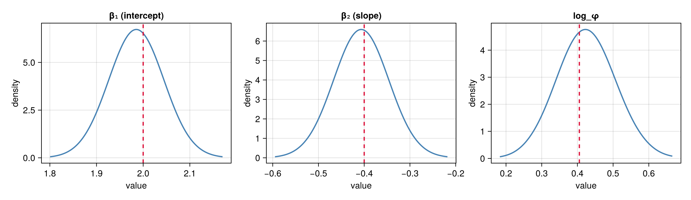

# Custom likelihoods: Tweedie regression on insurance claims

Most Bayesian inference packages ship a fixed menu of observation
likelihoods — Poisson, Binomial, Normal, maybe Negative Binomial — and
anything outside that menu either requires hacking the package's C
layer or falls back to slow black-box samplers. Latte takes a different
stance: any distribution you can write down as a `logpdf` can be used
inside `inla()`, with full posterior uncertainty over both the latent
field and the hyperparameters.

This tutorial walks through that workflow on a likelihood R-INLA does
not provide at all: the **Tweedie compound Poisson-Gamma**. The Tweedie
is the canonical model for *zero-inflated continuous* responses —
insurance claim amounts, daily rainfall, fish catch biomass — where
most observations are exactly zero and the rest follow a continuous
right-skewed distribution.

Along the way you will learn:
- How to wrap a hand-coded log-density as a `Distribution` subtype that
  slots into a DPPL `@model`.
- How Latte's adapter routes any custom `~` distribution through the
  `AutoDiffObservationModel` AD path, with no changes to the
  `inla()` call.
- How to recover both the regression coefficients and the dispersion
  hyperparameter from a single fit.

## Why Tweedie?

A Tweedie distribution with power parameter `1 < p < 2` is exactly a
*compound Poisson-Gamma*: each observation `Y` arises by first drawing
a count `N ~ Poisson(λ)` and then summing `N` iid Gamma claim sizes,

```math
Y = \sum_{i=1}^{N} X_i, \qquad X_i \sim \text{Gamma}(\alpha, \beta).
```

When `N = 0` the sum is zero (no claim). When `N ≥ 1` the sum is a
continuous, right-skewed Gamma-shaped quantity. The parameters fold
into a clean (mean, dispersion, power) parametrisation,

```math
\mathbb{E}[Y] = \mu, \qquad \mathrm{Var}[Y] = \phi \mu^p,
```

with `λ = μ^(2-p)/(φ(2-p))`, `α = (2-p)/(p-1)`, `β = φ(p-1)μ^(p-1)`.
That power variance function — variance scaling like `μ^p` — is what
gives Tweedie its modelling reach: `p = 1` is Poisson, `p = 2` is
Gamma, `1 < p < 2` interpolates between them.

## A custom `Distribution`

The Tweedie pdf has no closed form. Dunn & Smyth (2005) give a
numerically stable series expansion — exactly the kind of thing that
is awkward to write in C inside R-INLA but is just a few lines of
Julia.

We use the compound Poisson–Gamma form. At `y = 0` the density is
atomic: `P(Y = 0) = exp(-λ)`. For `y > 0` the density factors as

```math
f(y) = e^{-\lambda - y/\beta} \, y^{-1} \sum_{n \ge 1}
  \frac{\lambda^n}{n!}\,\frac{(y/\beta)^{n\alpha}}{\Gamma(n\alpha)},
```

and we sum the inner series in log-space with the standard log-sum-exp
trick.

````julia
using Distributions
using Distributions: loggamma

"Compute log Σ_{n=1}^{n_max} term(n) with log-sum-exp stabilisation."
function _tweedie_log_W(y, μ, φ, p; n_max::Int = 150)
    α = (2 - p) / (p - 1)
    log_y = log(y)
    log_λ = (2 - p) * log(μ) - log(φ * (2 - p))
    log_β = log(φ * (p - 1)) + (p - 1) * log(μ)
    log_term(n) = n * log_λ - loggamma(n + 1) +
        n * α * (log_y - log_β) - loggamma(n * α)
    m = log_term(1)
    @inbounds for n in 2:n_max
        t = log_term(n)
        if t > m
            m = t
        end
    end
    s = zero(m)
    @inbounds for n in 1:n_max
        s += exp(log_term(n) - m)
    end
    return m + log(s)
end

"Tweedie compound Poisson-Gamma log-density at `y` with mean μ, dispersion φ, power p ∈ (1,2)."
function tweedie_logpdf(y, μ, φ, p)
    log_λ = (2 - p) * log(μ) - log(φ * (2 - p))
    if y == 0
        return -exp(log_λ)
    else
        log_β = log(φ * (p - 1)) + (p - 1) * log(μ)
        return -exp(log_λ) - y / exp(log_β) - log(y) +
            _tweedie_log_W(y, μ, φ, p)
    end
end
````

````
Main.var"##225".tweedie_logpdf
````

To use this inside a DPPL `@model`, we wrap it as a tiny
`Distribution` subtype. Latte will recognise the resulting `~`
statements and route them through the AD-based observation model
automatically — no further wiring needed.

````julia
struct Tweedie{T <: Real} <: ContinuousUnivariateDistribution
    μ::T
    φ::T
    p::T
end
# Promoting constructor lets users mix Float and AD Dual arguments.
function Tweedie(μ::Real, φ::Real, p::Real)
    μp, φp, pp = promote(μ, φ, p)
    return Tweedie{typeof(μp)}(μp, φp, pp)
end
Distributions.logpdf(d::Tweedie, y::Real) = tweedie_logpdf(y, d.μ, d.φ, d.p)
Distributions.minimum(::Tweedie) = 0.0
Distributions.maximum(::Tweedie) = Inf
Distributions.insupport(::Tweedie, y::Real) = y >= 0
````

A quick sanity check: as `p → 2` the compound Poisson-Gamma collapses
to a single Gamma. The limiting parameters come from the compound
representation: with `N ~ Poisson(λ)` Poisson-many `Gamma(α, β)` claims,
`Y` has approximate Gamma shape `λ·α = μ^(2-p)/(φ(p-1))` and scale
`β = φ(p-1)μ^(p-1)`. As `p → 2`, `λ·α → 1/φ` and `β → φμ`. So at any
`p` close to 2 our `tweedie_logpdf` should approach
`Gamma(λ·α, β)` — and at `p ≈ 2` exactly, `Gamma(1/φ, φμ)`.

````julia
let μ = 5.0, φ = 1.0, p = 1.99, y = 4.0
    λα = μ^(2 - p) / (φ * (p - 1))      # limiting Gamma shape
    β = φ * (p - 1) * μ^(p - 1)         # limiting Gamma scale
    (tweedie_logpdf(y, μ, φ, p), logpdf(Gamma(λα, β), y))
end
````

````
(-2.4025734870815825, -2.3949828400519615)
````

Match within ~0.01 nats — the residual closes as `p → 2`.

## Simulating an insurance-style dataset

We simulate `n = 200` policies. Each policy has a single covariate (a
standardised driver-risk score). The mean claim is `log-linear`:
`log μ = β₀ + β₁ · x`. Truth: `β = [2.0, -0.4]`, `φ = 1.5`, `p = 1.6`.

````julia
using LinearAlgebra
using Random
using DataFrames

function rand_tweedie(rng, μ, φ, p)
    λ = μ^(2 - p) / (φ * (2 - p))
    α = (2 - p) / (p - 1)
    β_scale = φ * (p - 1) * μ^(p - 1)
    n = rand(rng, Poisson(λ))
    n == 0 && return 0.0
    return rand(rng, Gamma(n * α, β_scale))
end

Random.seed!(42)
n = 200
true_β = [2.0, -0.4]
X = hcat(ones(n), randn(n))
true_μ = exp.(X * true_β)
true_φ = 1.5
true_p = 1.6
y = [rand_tweedie(Random.GLOBAL_RNG, μ_i, true_φ, true_p) for μ_i in true_μ]

df = DataFrame(x = X[:, 2], claim = y, has_claim = y .> 0)
````

````
200×3 DataFrame
 Row │ x             claim       has_claim
     │ Float64       Float64     Bool
─────┼─────────────────────────────────────
   1 │ -0.363357     16.2249          true
   2 │  0.251737      4.57096         true
   3 │ -0.314988      6.68916         true
   4 │ -0.311252      3.5185          true
   5 │  0.816307      3.54193         true
   6 │  0.476738      6.91954         true
   7 │ -0.859555      5.86323         true
   8 │ -1.46929       5.55706         true
   9 │ -2.11433       9.74687         true
  10 │  0.0437817     4.90711         true
  11 │ -0.825335      6.58729         true
  12 │  0.840289      2.99481         true
  13 │  0.433886      1.41906         true
  14 │ -0.39544       7.62115         true
  15 │  0.517131      8.43145         true
  16 │  1.44722       4.09906         true
  17 │ -0.0930779     5.02378         true
  18 │ -1.27259       3.48587         true
  19 │ -0.310744      4.60564         true
  20 │ -0.096581      2.56055         true
  21 │ -1.38281      12.419           true
  22 │ -1.46245      21.823           true
  23 │  1.30097       2.15675         true
  24 │  2.26628       0.0            false
  25 │  1.51239       3.29996         true
  26 │  0.648849      4.31706         true
  27 │  0.899944      4.61658         true
  28 │  0.284158      0.0            false
  29 │  1.10359       7.59125         true
  30 │  0.663883      0.0            false
  31 │  0.171271     22.4954          true
  32 │  1.11992       7.91681         true
  33 │  1.92075       4.45137         true
  34 │  0.800649      2.81246         true
  35 │ -0.385611     25.9577          true
  36 │ -0.439725      1.15243         true
  37 │  0.629883     15.2248          true
  38 │ -0.0696122    13.1305          true
  39 │ -0.778912      6.77251         true
  40 │ -0.878742      4.68112         true
  41 │  0.244053     20.151           true
  42 │  0.322373      8.38469         true
  43 │  2.0411        0.0            false
  44 │ -0.165234      4.54705         true
  45 │ -0.170959      3.9575          true
  46 │ -0.815115      6.32493         true
  47 │ -0.900545     39.565           true
  48 │ -0.193007      0.0389135       true
  49 │ -0.998374      1.59657         true
  50 │ -1.54106       4.57454         true
  51 │ -0.619705      0.166966        true
  52 │  0.635705      1.9171          true
  53 │ -0.478623     25.8838          true
  54 │  0.994696      0.0            false
  55 │  0.330335      4.55489         true
  56 │  0.377489      7.97014         true
  57 │ -1.73318      16.1767          true
  58 │ -0.907371     14.5848          true
  59 │  1.31102       6.07318         true
  60 │  0.0239511     2.27323         true
  61 │  1.2253        2.00046         true
  62 │  1.30437       5.30299         true
  63 │ -0.440017      2.53245         true
  64 │ -1.77994      17.2346          true
  65 │  0.958348      2.80751         true
  66 │ -1.17325       2.25568         true
  67 │  0.541542      4.36613         true
  68 │ -2.12513      13.1694          true
  69 │ -0.491015     18.6498          true
  70 │ -0.544347      5.41894         true
  71 │ -1.05103      11.6315          true
  72 │  1.19796       7.09477         true
  73 │  0.930004      8.57671         true
  74 │ -0.0320297     5.3301          true
  75 │ -0.891578      3.02055         true
  76 │  0.914778      8.94052         true
  77 │ -1.59561      25.4396          true
  78 │ -0.454048     17.9228          true
  79 │  0.0449514     9.32287         true
  80 │ -0.792283      7.9172          true
  81 │  0.373245      4.6297          true
  82 │ -1.40466      20.5179          true
  83 │ -1.23477       9.94414         true
  84 │ -0.125307      2.65889         true
  85 │ -0.785657      4.39925         true
  86 │ -0.408099      0.0789021       true
  87 │ -1.7268       27.685           true
  88 │  0.557077      3.59099         true
  89 │ -0.391454      8.9793          true
  90 │ -0.250763      5.30031         true
  91 │  1.02184       6.60896         true
  92 │ -0.000939762   0.0            false
  93 │ -1.50078      16.2018          true
  94 │  0.262925      4.4723          true
  95 │ -1.06112       4.41515         true
  96 │  1.03642       6.41243         true
  97 │  0.723465     17.57            true
  98 │  0.85416       6.18341         true
  99 │  0.368207     25.276           true
 100 │ -0.0465609     9.81588         true
 101 │  1.70818       0.444303        true
 102 │ -1.03105      11.3143          true
 103 │ -0.144414      3.19855         true
 104 │ -1.62692       9.20179         true
 105 │ -0.0621749     5.32335         true
 106 │  0.214392      4.06039         true
 107 │  1.52944       2.1687          true
 108 │  0.274373      2.83103         true
 109 │  1.72908       0.209662        true
 110 │ -0.878513     14.0332          true
 111 │ -0.428058      4.61016         true
 112 │ -0.272718      7.58587         true
 113 │ -0.835183      0.965423        true
 114 │  0.955254      1.37424         true
 115 │  1.24388       6.72059         true
 116 │  0.609166     15.3817          true
 117 │ -0.340788      6.00229         true
 118 │ -1.86236      19.0778          true
 119 │ -1.80716      12.9942          true
 120 │ -0.302152      2.31626         true
 121 │  0.523546      9.99791         true
 122 │  0.316563      2.66139         true
 123 │ -0.237048     10.1688          true
 124 │ -0.996095     19.7933          true
 125 │  0.198834      4.79503         true
 126 │  0.137107      0.546861        true
 127 │  0.11928      20.6076          true
 128 │ -0.145555     11.7485          true
 129 │  0.445526      3.99925         true
 130 │ -0.301341      4.69444         true
 131 │  0.818663     17.5369          true
 132 │  0.282964      3.11503         true
 133 │ -0.686012      6.71322         true
 134 │ -1.53571       5.07314         true
 135 │ -0.848397      7.62971         true
 136 │  0.553141      0.599953        true
 137 │ -1.10375      26.6566          true
 138 │  1.44155       5.1535          true
 139 │ -0.862972     23.0304          true
 140 │ -0.408714      5.59804         true
 141 │  0.0947238    18.9799          true
 142 │ -0.327599     16.987           true
 143 │  1.52068       3.75599         true
 144 │  0.482169      4.1115          true
 145 │  0.348033     11.7631          true
 146 │  1.07978       1.17011         true
 147 │  0.719971      0.107081        true
 148 │ -0.403993      5.16151         true
 149 │ -1.03658       8.67729         true
 150 │ -1.04569       4.14016         true
 151 │  0.156894      0.127757        true
 152 │ -0.490394      1.52591         true
 153 │  0.241658      7.43011         true
 154 │ -1.09532       9.42424         true
 155 │ -0.402337      5.62667         true
 156 │ -1.40657      21.5671          true
 157 │ -0.942206      8.82156         true
 158 │  0.49556      11.3488          true
 159 │  1.24562       0.0            false
 160 │ -1.62826       8.13188         true
 161 │  0.863536      6.94363         true
 162 │  0.85458       0.123158        true
 163 │ -0.872384     13.4363          true
 164 │  1.42314       2.05645         true
 165 │ -0.898847      2.98721         true
 166 │  0.595226      5.41722         true
 167 │  0.911608      0.138377        true
 168 │ -0.325225      1.25421         true
 169 │ -1.06828      13.9048          true
 170 │  2.39172       1.66284         true
 171 │ -0.164129      1.45484         true
 172 │  0.895277      4.33394         true
 173 │ -0.38241       0.0292193       true
 174 │ -0.121225      2.44514         true
 175 │  0.539813      6.50969         true
 176 │  0.703736     10.004           true
 177 │ -2.74802      24.3773          true
 178 │ -0.497881     15.491           true
 179 │  1.22918       6.59445         true
 180 │  2.31031       0.481662        true
 181 │  0.284047      0.526609        true
 182 │  0.961592      6.08894         true
 183 │  0.188042     16.6158          true
 184 │  1.24849       6.20199         true
 185 │  0.368985      4.80292         true
 186 │  0.546112      2.14599         true
 187 │  0.369809      6.09264         true
 188 │ -0.982429     10.4187          true
 189 │  0.736969     19.8137          true
 190 │  0.284768      4.6726          true
 191 │ -2.05637      16.5324          true
 192 │  0.566839      0.87022         true
 193 │  0.717872      8.40019         true
 194 │ -1.11375      10.2643          true
 195 │ -0.807109     11.1178          true
 196 │ -0.80858       3.92699         true
 197 │  1.79954       7.32952         true
 198 │ -0.844068     39.1304          true
 199 │ -1.52932      12.2728          true
 200 │ -0.195099     11.4011          true
````

About 4% of policies file no claim at all; the rest are continuous,
right-skewed claim amounts. Visualised:

````julia
using AlgebraOfGraphics, CairoMakie

fig = Figure(size = (820, 360))
ax1 = Axis(
    fig[1, 1], title = "Claim distribution",
    xlabel = "Claim amount", ylabel = "Density",
)
hist!(ax1, y; bins = 40, color = (:steelblue, 0.6), strokewidth = 0)
ax2 = Axis(
    fig[1, 2], title = "Claim vs covariate",
    xlabel = "Driver risk score (x)", ylabel = "Claim amount",
)
scatter!(ax2, df.x, df.claim; markersize = 7, color = (:black, 0.5))
fig
````


The cluster of zero-claim policies plus the long right tail is the
zero-inflated-continuous shape Tweedie was designed for.

## The model

The DPPL model is the same shape as any other Latte regression: a
hyperparameter prior, a Gaussian prior on the regression coefficients,
and a `~` statement per observation. The only thing that's "custom"
about it is the `Tweedie(...)` distribution — Latte handles the rest.

We treat the Tweedie power `p` as a fixed domain choice (`p = 1.6` is
typical for claim severity). This keeps the hyperparameter dimension
at 1 and the inference focused on the dispersion `φ` and the
regression coefficients `β`. If you wanted to learn `p` from data,
you'd add it as another `~` line and Latte would happily integrate
over it too.

````julia
using Latte
using DynamicPPL: @model

@model function tweedie_glm(y, X, p_fixed)
    log_φ ~ Normal(0.0, 2.0)
    φ = exp(log_φ)
    β ~ MvNormal(zeros(size(X, 2)), 100.0 * I(size(X, 2)))
    for i in eachindex(y)
        μ_i = exp(dot(X[i, :], β))
        y[i] ~ Tweedie(μ_i, φ, p_fixed)
    end
end
````

````
tweedie_glm (generic function with 2 methods)
````

Two notes worth calling out for the curious:

- The custom Tweedie likelihood is **not** in Latte's fast-path table
  (Poisson, Bernoulli, Binomial, Normal, NegativeBinomial, Gamma), so
  the adapter routes it through `AutoDiffObservationModel`. This gives
  us first-class support for any `logpdf` we can write — including
  ones with infinite series like Tweedie — at the cost of a bit more
  compile time on the first call.
- We pass `likelihood_hessian_pattern = :dense` because the Tweedie
  series expansion isn't traceable by `SparseConnectivityTracer` (the
  `for` loop over series terms breaks tracer propagation). For a
  `n = 200` dataset a dense Hessian is tiny; for very large `n` you
  might want to provide a known sparse pattern explicitly.

````julia
lgm = latte_from_dppl(
    tweedie_glm(y, X, true_p);
    random = :β, likelihood_hessian_pattern = :dense,
)
````

````
LatentGaussianModel
  Hyperparameter spec:
    HyperparameterSpec with 1 parameters:
  Free parameters (1):
    log_φ ~ Distributions.Normal{Float64}(μ=0.0, σ=2.0) via identityⁿ

  Latent prior function: Latte.FunctionLatentModel{Latte.var"#latent_fn#399"{Latte.var"#latent_fn#395#400"{DynamicPPL.Model{typeof(Main.var"##225".tweedie_glm), (:y, :X, :p_fixed), (), (), Tuple{Vector{Float64}, Matrix{Float64}, Float64}, Tuple{}, DynamicPPL.DefaultContext, false}, Tuple{Symbol}, @NamedTuple{dims::Dict{Symbol, Int64}, classification::Dict{Symbol, Symbol}, edges::Dict{Symbol, Vector{Symbol}}}, Tuple{Symbol}, SparseArrays.SparseMatrixCSC{Bool, Int64}, Dict{Tuple{Symbol, Symbol}, NamedTuple}}}, Nothing}
  Observation model: GaussianMarkovRandomFields.AutoDiffObservationModel{Latte.var"#loglik#415"{Latte.var"#loglik#410#416"{Tuple{Symbol}, DynamicPPL.Model{typeof(Main.var"##225".tweedie_glm), (:y, :X, :p_fixed), (), (), Tuple{Vector{Float64}, Matrix{Float64}, Float64}, Tuple{}, DynamicPPL.DefaultContext, false}}}, ADTypes.AutoForwardDiff{nothing, Nothing}, ADTypes.AutoSparse{ADTypes.AutoForwardDiff{nothing, Nothing}, ADTypes.KnownHessianSparsityDetector{SparseArrays.SparseMatrixCSC{Bool, Int64}}, SparseMatrixColorings.GreedyColoringAlgorithm{:direct, 1, Tuple{SparseMatrixColorings.NaturalOrder}}}, Tuple{Symbol}, Latte.var"#pointwise_loglik#418"{Latte.var"#pointwise_loglik#412#419"{Tuple{Symbol}, DynamicPPL.Model{typeof(Main.var"##225".tweedie_glm), (:y, :X, :p_fixed), (), (), Tuple{Vector{Float64}, Matrix{Float64}, Float64}, Tuple{}, DynamicPPL.DefaultContext, false}, Tuple{Symbol}, Dict{Symbol, UnitRange{Int64}}}}}

````

## Running INLA

The custom likelihood doesn't change anything about the call:

````julia
result = inla(
    lgm, y;
    latent_marginalization_method = SimplifiedLaplace(),
    progress = false,
)
````

````
INLAResult:
  Model: Latte.LatentGaussianModel{Latte.HyperparameterSpec{@NamedTuple{log_φ::Latte.Hyperparameter{typeof(identity), :natural}}, @NamedTuple{}}, Latte.FunctionLatentModel{Latte.var"#latent_fn#399"{Latte.var"#latent_fn#395#400"{DynamicPPL.Model{typeof(Main.var"##225".tweedie_glm), (:y, :X, :p_fixed), (), (), Tuple{Vector{Float64}, Matrix{Float64}, Float64}, Tuple{}, DynamicPPL.DefaultContext, false}, Tuple{Symbol}, @NamedTuple{dims::Dict{Symbol, Int64}, classification::Dict{Symbol, Symbol}, edges::Dict{Symbol, Vector{Symbol}}}, Tuple{Symbol}, SparseArrays.SparseMatrixCSC{Bool, Int64}, Dict{Tuple{Symbol, Symbol}, NamedTuple}}}, Nothing}, GaussianMarkovRandomFields.AutoDiffObservationModel{Latte.var"#loglik#415"{Latte.var"#loglik#410#416"{Tuple{Symbol}, DynamicPPL.Model{typeof(Main.var"##225".tweedie_glm), (:y, :X, :p_fixed), (), (), Tuple{Vector{Float64}, Matrix{Float64}, Float64}, Tuple{}, DynamicPPL.DefaultContext, false}}}, ADTypes.AutoForwardDiff{nothing, Nothing}, ADTypes.AutoSparse{ADTypes.AutoForwardDiff{nothing, Nothing}, ADTypes.KnownHessianSparsityDetector{SparseArrays.SparseMatrixCSC{Bool, Int64}}, SparseMatrixColorings.GreedyColoringAlgorithm{:direct, 1, Tuple{SparseMatrixColorings.NaturalOrder}}}, Tuple{Symbol}, Latte.var"#pointwise_loglik#418"{Latte.var"#pointwise_loglik#412#419"{Tuple{Symbol}, DynamicPPL.Model{typeof(Main.var"##225".tweedie_glm), (:y, :X, :p_fixed), (), (), Tuple{Vector{Float64}, Matrix{Float64}, Float64}, Tuple{}, DynamicPPL.DefaultContext, false}, Tuple{Symbol}, Dict{Symbol, UnitRange{Int64}}}}}}
  Hyperparameters: 1
  Latent variables: 2
  Mode: (log_φ=0.4225)
  Convergence: ✓
  Total time: 11.13 seconds
  Exploration: 9 points (9 integration)

Model comparison metrics:
Deviance Information Criterion (DIC):
  DIC: 1214.72
  Effective parameters (p_D): 0.99
  Mean deviance (D̄): 1213.73
  Deviance at mode: 1212.73

Marginal Log-Likelihood:
  log p(y): -619.84

Watanabe-Akaike Information Criterion (WAIC):
  WAIC: 1217.88
  Effective parameters (p_WAIC): 2.47
  Log pointwise predictive density (lppd): -606.47

Conditional Predictive Ordinates (CPO):
  LPML: -608.99
  Mean CPO: 0.061
  Min CPO: 0.0009


Approximation quality (KLD):
  Max SKLD: 0.0000 (variable 1)
  Mean SKLD: 0.0000

Use .hyperparameter_marginals, .latent_marginals, .accumulators for analysis
````

## Posteriors

`result.latent_marginals` holds posterior marginals for `β`, and
`result.hyperparameter_marginals` holds the marginal for `log_φ`.
Both are `Distributions.jl`-compatible objects, so we can call
`mean`, `std`, `quantile`, etc. directly:

````julia
β_summary = summary_df(result.latent_marginals)
````

````
2×6 DataFrame
 Row │ mode      median     q2_5       q97_5      mean      std
     │ Float64   Float64    Float64    Float64    Float64   Float64
─────┼────────────────────────────────────────────────────────────────
   1 │  1.9853    1.9853     1.86866    2.10194    1.9853   0.059466
   2 │ -0.40657  -0.406571  -0.525543  -0.287593  -0.40657  0.0606584
````

...and the dispersion marginal:

````julia
hp_summary = summary_df(result.hyperparameter_marginals)
````

````
1×7 DataFrame
 Row │ parameter  mode      median    q2_5      q97_5     mean      std
     │ Symbol     Float64   Float64   Float64   Float64   Float64   Float64
─────┼────────────────────────────────────────────────────────────────────────
   1 │ log_φ      0.422496  0.423963  0.257306  0.594421  0.423044  0.0857676
````

Compare to truth:

````julia
truth = DataFrame(
    parameter = ["β₁ (intercept)", "β₂ (slope)", "log_φ"],
    truth = [true_β[1], true_β[2], log(true_φ)],
    posterior_mean = [β_summary.mean[1], β_summary.mean[2], hp_summary.mean[1]],
    q2_5 = [β_summary.q2_5[1], β_summary.q2_5[2], hp_summary.q2_5[1]],
    q97_5 = [β_summary.q97_5[1], β_summary.q97_5[2], hp_summary.q97_5[1]],
)
````

````
3×5 DataFrame
 Row │ parameter       truth      posterior_mean  q2_5       q97_5
     │ String          Float64    Float64         Float64    Float64
─────┼─────────────────────────────────────────────────────────────────
   1 │ β₁ (intercept)   2.0             1.9853     1.86866    2.10194
   2 │ β₂ (slope)      -0.4            -0.40657   -0.525543  -0.287593
   3 │ log_φ            0.405465        0.423044   0.257306   0.594421
````

All three true values land squarely inside the 95% credible intervals.
We can also visualise the marginal posteriors:

````julia
fig2 = Figure(size = (1100, 320))
for (j, (name, marginal, true_val)) in enumerate(
        [
            ("β₁ (intercept)", result.latent_marginals[1], true_β[1]),
            ("β₂ (slope)", result.latent_marginals[2], true_β[2]),
            ("log_φ", result.hyperparameter_marginals.log_φ, log(true_φ)),
        ]
    )
    ax = Axis(fig2[1, j]; title = name, xlabel = "value", ylabel = "density")
    xs = range(quantile(marginal, 0.001), quantile(marginal, 0.999); length = 200)
    lines!(ax, xs, pdf.(marginal, xs); color = :steelblue, linewidth = 2)
    vlines!(ax, [true_val]; color = :crimson, linestyle = :dash, linewidth = 2)
end
fig2
````


Red dashed lines mark the true values; the posteriors concentrate
around them with sensible width. Dispersion `log_φ ≈ 0.40` corresponds
to `φ ≈ 1.5`, our generative truth.

## Takeaway

Anything you can write down as a `logpdf(::MyDist, y)` is a first-class
observation likelihood in Latte. No upstream package edits, no manual
Hessian derivations, no MCMC fallback — the same `inla()` call that
fits a Poisson regression fits a Tweedie regression, an ordinal model,
a heavy-tailed Student-t, a Bayesian quantile regression via the
asymmetric Laplace, or whatever else your domain throws at you.

A couple of practical tips when writing your own:

- Keep the `logpdf` AD-friendly: any control flow should depend on
  `y` (data, fixed) rather than on the parameters, and avoid
  `Float64`-typed buffers inside the function body — use comprehensions
  or `similar(x, T)` so eltype propagates from the inputs.
- If your `logpdf` involves an iterative computation (series, root
  solver, ODE solver) that's opaque to sparsity tracing, pass
  `likelihood_hessian_pattern = :dense` to `latte_from_dppl` to
  short-circuit pattern detection.
- For genuinely conditionally-independent likelihoods — which is most
  of them — supplying `pointwise_loglik_func` lets Latte use a fast
  diagonal-Hessian path. The DPPL adapter handles this automatically;
  if you build your `LatentGaussianModel` by hand, pass it explicitly
  to `AutoDiffObservationModel`.

Curious where else this pattern lands well? See the rest of the
tutorials gallery for hierarchical regressions, smoothing priors,
spatial models, and more.

---

*This page was generated using [Literate.jl](https://github.com/fredrikekre/Literate.jl).*

